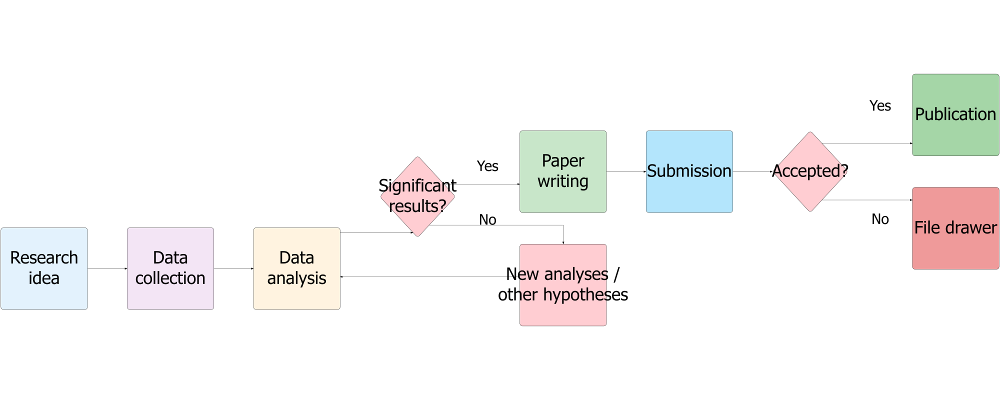
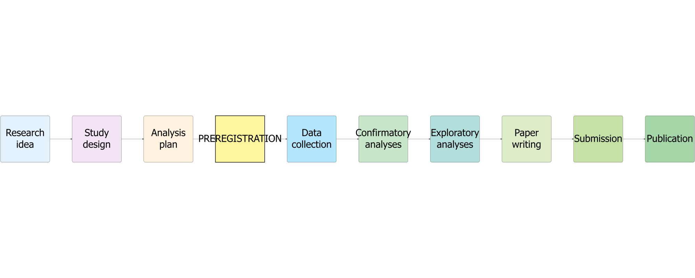

## Traditional Workflow

```{r}
#| label: fig-traditional-workflow
#| fig-cap: "Traditional research workflow"
#| echo: false
#| warning: false
#| message: false

library(DiagrammeR)
library(DiagrammeRsvg)
library(rsvg)

diag <- grViz("
digraph G {
    rankdir=LR;
    graph [splines=ortho, nodesep=2.0, ranksep=2.5, bgcolor=transparent];
    node [shape=box, style='rounded,filled', fontname='Helvetica', fontsize=78, 
          width=5.5, height=5.2, fixedsize=true];
    edge [fontsize=66, fontname='Helvetica'];
    
    A [label='Research\nidea', fillcolor='#e3f2fd'];
    B [label='Data\ncollection', fillcolor='#f3e5f5'];
    C [label='Data\nanalysis', fillcolor='#fff3e0'];
    D [label='Significant\nresults?', shape=diamond, fillcolor='#ffcdd2', width=4.8];
    E [label='Paper\nwriting', fillcolor='#c8e6c9'];
    F [label='New analyses /\nother hypotheses', fillcolor='#ffcdd2'];
    G [label='Submission', fillcolor='#b3e5fc'];
    H [label='Accepted?', shape=diamond, fillcolor='#ffcdd2', width=4.8];
    I [label='Publication', fillcolor='#a5d6a7'];
    J [label='File drawer', fillcolor='#ef9a9a'];
    
    A -> B -> C -> D;
    D -> E [label='Yes'];
    D -> F [label='No'];
    F -> C;
    E -> G -> H;
    H -> I [label='Yes'];
    H -> J [label='No'];
}
")

export_svg(diag) |>
  charToRaw() |>
  rsvg_png("traditional_workflow.png", width = 2000, height = 800)


```

---

## Workflow with Preregistration

```{r}
#| label: fig-preregistration-workflow
#| fig-cap: "Research workflow with preregistration"
#| echo: false
#| warning: false
#| message: false

library(DiagrammeR)
library(DiagrammeRsvg)
library(rsvg)

diag <- grViz("
digraph G {
    rankdir=LR;
    graph [splines=ortho, nodesep=2.0, ranksep=2.5, bgcolor=transparent];
    node [shape=box, style='rounded,filled', fontname='Helvetica', fontsize=78, 
          width=5.5, height=5.2, fixedsize=true];
    edge [fontsize=66, fontname='Helvetica'];
    
    A [label='Research\nidea', fillcolor='#e3f2fd'];
    B [label='Study\ndesign', fillcolor='#f3e5f5'];
    C [label='Analysis\nplan', fillcolor='#fff3e0'];
    D [label='PREREGISTRATION', fillcolor='#fff59d', style='filled,bold', penwidth=4];
    E [label='Data\ncollection', fillcolor='#b3e5fc'];
    F [label='Confirmatory\nanalyses', fillcolor='#c8e6c9'];
    G [label='Exploratory\nanalyses', fillcolor='#b2dfdb'];
    H [label='Paper\nwriting', fillcolor='#dcedc8'];
    I [label='Submission', fillcolor='#c5e1a5'];
    J [label='Publication', fillcolor='#a5d6a7'];
    
    A -> B -> C -> D -> E -> F -> G -> H -> I -> J;
}
")

export_svg(diag) |>
  charToRaw() |>
  rsvg_png("preregistration_workflow.png", width = 2000, height = 800)


```

---

## Paradigm shift: the research workflow

* Focus on statistically significant results
* Publication depends on results
* Pressure toward “positive” findings
* P-value < 0.05 as a publication criterion
* Hidden analytical flexibility

---

## Preregistered paradigm

* Focus on methodological quality and transparency
* Publication depends on methodological rigor
* Value of null results and confirmations
* Pre-specified analysis plan
* Deviations declared and justified
* All registered studies are traceable

---

**"Preregistration distinguishes analyses that result from predictions from those that result from postdictions"**
Nosek et al., 2018

---

## Many Templates

```{r}
#| echo: false
#| message: false

library(knitr)
library(dplyr)

# Dataframe con link cliccabili
prereg_types <- tibble(
  Template = c(
    "**OSF Preregistration**",
    "**Open-Ended Registration**",
    "**AsPredicted**",
    "**Generalized Systematic Review**",
    "**OSF-Standard Pre-Data Collection**",
    "**Qualitative Preregistration**",
    "**Registered Report Protocol**"
  ),
  Descrizione = c(
   "Standard and general template for empirical studies",
"Flexible, for complex projects",
"Short and structured (from aspredicted.org)",
"For systematic reviews and meta-analyses",
"Confirms that data have not yet been collected",
"For primarily qualitative studies",
"After in-principle acceptance"
  ),
  Link = c(
    "[OSF.IO/VH8PB](https://doi.org/10.17605/OSF.IO/VH8PB)",
    "[OSF.IO/YRP3F](https://doi.org/10.17605/OSF.IO/YRP3F)",
    "[aspredicted.org](https://aspredicted.org/)",
    "[OSF.IO/F8QD5](https://doi.org/10.17605/OSF.IO/F8QD5)",
    "[OSF.IO/VH8PB](https://doi.org/10.17605/OSF.IO/VH8PB)",
    "[OSF.IO/SWJMN](https://doi.org/10.17605/OSF.IO/SWJMN)",
    "[OSF.IO/P5SJB](https://doi.org/10.17605/OSF.IO/P5SJB)"
  )
)

kable(prereg_types, format = "markdown")

```
## Materials and Resources

## Where to Find Templates and Guides

**Methodological Review Board**  

- **OSF Registries**: [osf.io/registries](https://osf.io/registries/)
- **AsPredicted**: [aspredicted.org](https://aspredicted.org/)
- **COS Resources**: [cos.io/initiatives/prereg](https://www.cos.io/initiatives/prereg)

<br>

## Other Useful Links

🔗 [methodological-review-board.github.io/materials.html](https://methodological-review-board.github.io/materials.html)

--- 
  
### What You Will Find

- Discipline-specific templates
- Video tutorials
- Examples of preregistrations
- Step-by-step guidelines
- FAQs and troubleshooting
- Best practices

---

## Critiques and Advantages of Preregistration

## Arguments in Favor

- **Prevents p-hacking** and selective analyses[^1][^2]
- **Increases transparency** and accountability[^2][^3]
- **Improves reproducibility** of studies[^3][^4]

---

## Arguments in Favor

- **Encourages more rigorous design**: requirement to plan in advance[^1][^5]
- **Reduces publication bias**: null results have a public record[^6]
- **Protects against external pressures** (funders, policy makers)[^6]
- **Facilitates collaboration**: plans shared and discussed in advance[^3][^7]

---

### Main Criticisms

- **Discourages exploratory research**: prioritizes a priori hypotheses only[^8][^9]
- **Excessive rigidity**: difficult to adapt to unexpected discoveries[^6][^8]
- **May increase initial workload** and project duration[^10]
- **Risk of bureaucratization**: preregistration as a formal “badge” rather than a tool[^11]

---

### Main Criticisms

- **Not suitable for all data types** (e.g., secondary data, complex qualitative studies)[^7]
- **Conflict with multiverse analyses** if interpreted rigidly[^11]

---
  
**Preregistration is a powerful tool but not a universal solution. It is important to distinguish confirmatory research (which benefits greatly) from exploratory research (which requires flexibility).**


---

## Example (in my experience)

[^1]: [Benefits of Pre-Registration - iCare Handbook](https://books.icarehb.com/4/icarehb-open-science-handbook/120/benefits-of-pre-registration)

[^2]: [Benefits and Concerns of Registration - OSF Support](https://help.osf.io/article/603-benefits-of-registration)

[^3]: [Preregistration (science) - Wikipedia](https://en.wikipedia.org/wiki/Preregistration_(science))

[^4]: [Preregistration: Definition, advantages, disadvantages - Tilburg University](https://research.tilburguniversity.edu/en/publications/preregistration-definition-advantages-disadvantages-and-how-it-ca)

[^5]: [Pre-registering your research - Leiden University](https://www.staff.universiteitleiden.nl/news/2025/09/pre-registering-your-research-extra-effort-but-whats-the-pay-off)

[^6]: [The pros and cons of research preregistration - OUP Blog](https://blog.oup.com/2014/09/pro-con-research-preregistration/)

[^7]: [A survey on how preregistration affects the research workflow](https://pmc.ncbi.nlm.nih.gov/articles/PMC9257590/)

[^8]: [The pros and cons of pre-registration in fundamental research](https://www.cogsci.nl/blog/miscellaneous/215-the-pros-and-cons-of-pre-registration-in-fundamental-research)

[^9]: [Pre-Registration of Scientific Studies: Pros and Cons - YouTube](https://www.youtube.com/watch?v=sWAINSENvOI)

[^10]: [A survey on how preregistration affects the research workflow - PMC](https://pmc.ncbi.nlm.nih.gov/articles/PMC9257590/)

[^11]: [On the Use and Misuses of Preregistration - PMC](https://pmc.ncbi.nlm.nih.gov/articles/PMC11871985/)

---

## Real-World Preregistration Examples

### Different Preregistrations in Action

**1. Clinical Psychology Study Preregistration**  
[OSF Preprint: Clinical Psychology Study](https://osf.io/preprints/osf/6krn7_v1)

**2. Multilab Secondary Analysis Preregistration**  
[OSF Project: Secondary Data Analysis](https://osf.io/wt79h/overview)

**3. Multilab Pre-Data Collection Registration**  
[HAL Science](https://hal.science/hal-04383754/) | [ManyBabies MB5 Project](https://manybabies.org/MB5/)

**4. Preregistered Multilab Analysis (Published)**  
[Science Direct: Multilab Study](https://www.sciencedirect.com/science/article/pii/S0163638323000826)

**5. My First Preregistration (2019)**  
[OSF Project: First Attempt](https://osf.io/pefw8/overview)

---

**These examples show the diversity of preregistration approaches: single-lab clinical studies, secondary data analysis, large collaborative projects (ManyBabies), and published multilab studies. Each demonstrates how preregistration adapts to different research contexts.**


